[2020-2021学年第2学期](https://plc-sigcc.vercel.app/#/lab/proj.final?id=_2020-2021%e5%ad%a6%e5%b9%b4%e7%ac%ac2%e5%ad%a6%e6%9c%9f)

[**实 验 报 告**](https://plc-sigcc.vercel.app/#/lab/proj.final?id=%e5%ae%9e-%e9%aa%8c-%e6%8a%a5-%e5%91%8a)


* 课程名称:编程语言原理与编译
* 实验项目:期末大作业
* 专业班级__计算1903_
* 学生学号__31901072_
* 学生姓名__高扬_
* 实验指导教师:张芸

| 姓名 | 学号     | 班级     | 任务 | 权重 |
| ---- | -------- | -------- | ---- | ---- |
| 高扬 | 31901072 | 计算1903 | 全部 | 1.0  |

成员代码提交日志：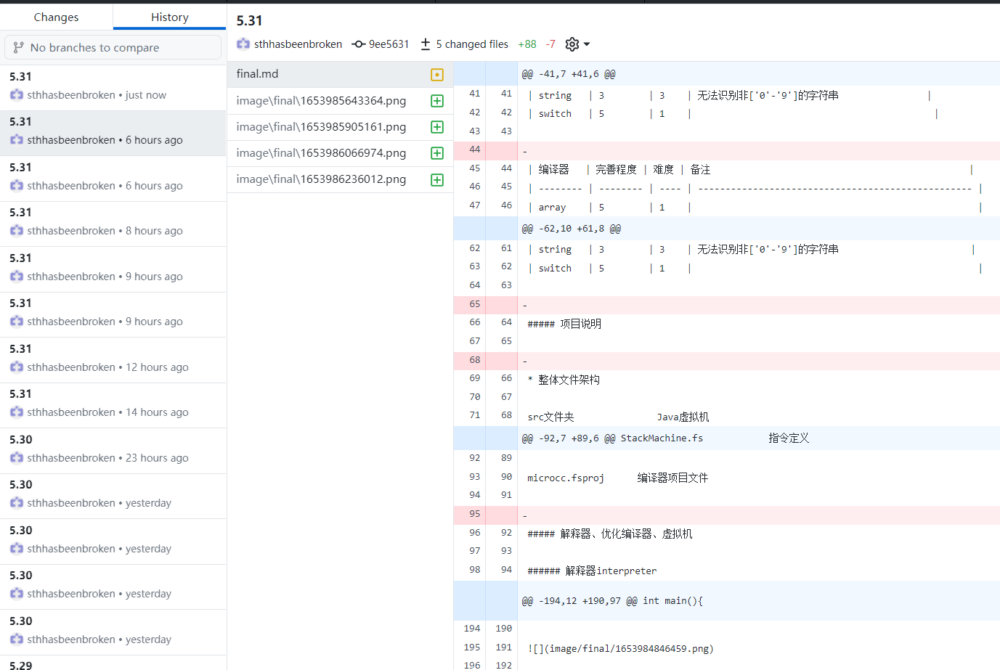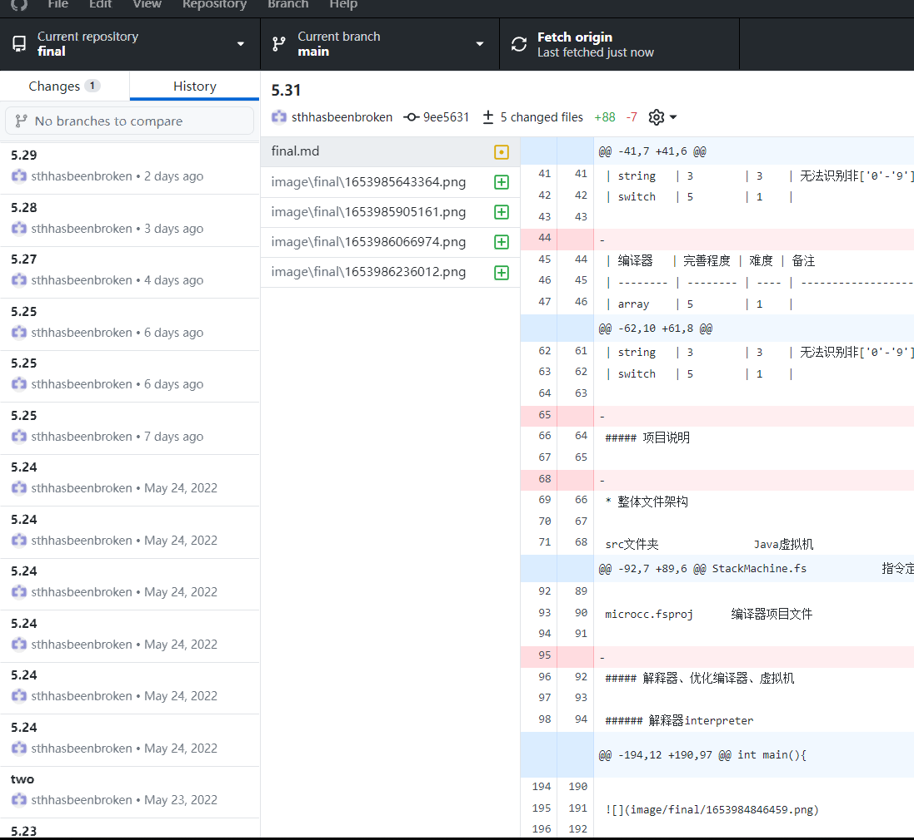

项目自评等级:(1-5)

| 解释器   | 完善程度 | 难度 | 备注                                       |
| -------- | -------- | ---- | ------------------------------------------ |
| array    | 5        | 1    |                                            |
| bool     | 5        | 2    |                                            |
| break    | 5        | 1    | 通过failwith直接跳出                       |
| continue | 3        | 1    | 通过failwith直接跳出存在错误               |
| char     | 5        | 1    |                                            |
| dountil  | 5        | 1    |                                            |
| dowhile  | 5        | 1    |                                            |
| float    | 5        | 3    |                                            |
| for      | 5        | 1    |                                            |
| forin    | 5        | 2    |                                            |
| hex      | 3        | 3    | 存在读入['a'-'f']['A'-'F']字符报错         |
| if       | 5        | 1    |                                            |
| int      | 5        | 1    |                                            |
| 三元运算 | 5        | 2    |                                            |
| print    | 5        | 1    |                                            |
| 自增     | 5        | 1    | 解释器中的自增在.c文件可写入循环等多种语境 |
| 自减     | 5        | 1    | 解释器中的自减在.c文件可写入循环等多种语境 |
| string   | 3        | 3    | 无法识别非['0'-'9']的字符串                |
| switch   | 5        | 1    |                                            |

| 编译器   | 完善程度 | 难度 | 备注                                               |
| -------- | -------- | ---- | -------------------------------------------------- |
| array    | 5        | 1    |                                                    |
| bool     | 5        | 2    |                                                    |
| char     | 5        | 1    |                                                    |
| dountil  | 5        | 1    |                                                    |
| dowhile  | 5        | 1    |                                                    |
| float    | 5        | 3    |                                                    |
| for      | 5        | 1    |                                                    |
| forin    | 5        | 2    |                                                    |
| hex      | 3        | 3    | 存在读入['a'-'f']['A'-'F']字符报错                 |
| if       | 5        | 1    |                                                    |
| int      | 5        | 1    |                                                    |
| 三元运算 | 5        | 2    |                                                    |
| print    | 4        | 1    | 打印16进制数时不会输出16进制数而是输出10进制的结果 |
| 自增     | 2        | 1    | 存在错误，在栈中无限+1造成栈溢出                   |
| 自减     | 2        | 1    | 存在错误，在栈中无限-1造成栈溢出                   |
| switch   | 5        | 1    |                                                    |

项目说明

* 整体文件架构

src文件夹               Java虚拟机

exampleinterp文件夹  解释器测试集

example文件夹   编译器测试集

Absyn.fs                 抽象语法

CLex.fsl          		fslex词法定义

CPar.fsy             	fsyacc语法定义

Parse.fs                 语法解析器

Interp.fs                 解释器

interpc.fsproj        项目文件

Contcomp.fs         编译器

StackMachine.fs            指令定义

microcc.fsproj      编译器项目文件

解释器、优化编译器、虚拟机

解释器interpreter

```
//编译解释器 interpc.exe 命令行程序 
dotnet restore  interpc.fsproj  //可选
dotnet clean  interpc.fsproj    //可选
dotnet build -v n interpc.fsproj //构建，-v n查看详细生成过程

//执行解释器
./bin/Debug/net5.0/interpc.exe example/int.c
dotnet run -p interpc.fsproj example/int.c
dotnet run -p interpc.fsproj -g example/int.c  //显示token AST 等调试信息
```

优化编译器complier

```
dotnet restore  microcc.fsproj
dotnet clean  microcc.fsproj
dotnet build  microcc.fsproj  //构建编译器

dotnet run -p microcc.fsproj example/int.c//执行编译器
./bin/Debug/net5.0/microcc.exe example/int.c  //直接执行

```

虚拟机JAVA

```
javac Machine.java
java Machine ex9.out 3

javac Machinetrace.java
java Machinetrace ../example/int.out
java Machinetrace ../example/int.out
```

项目说明

1.项目说明

解释器部分是基于现有代码 MICROC 的改进主要添加了上述表格中的功能。以下是具体的内容：

1. int类型：
   定义了HEX可以进行16进制的转化，输出函数为print 16 i，具体可见hex.c

   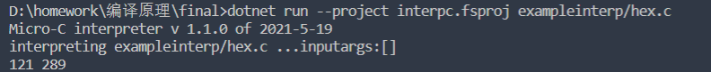
2. bool类型：（bool类型是我第一个做的类型，万事开头难，在byte转化的时候各种报错，查遍了.NET类型转化的文档尝试了各种方法还是报错，最后发现它true，false本身就可以是一个int类型）

   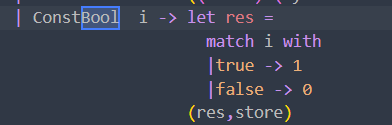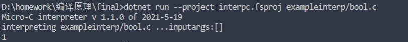
3. float类型：float的关键在于对原本的整形进行浮点数的转化，当初怎么样都输出不了浮点数，输出的是一长串的整形，最后经过转化得到成功。解释器中关键的代码先转化为整形存入store再读取整形转化为浮点数

   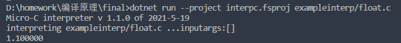
4. string类型：（不完整，只可以输出数字字符串）
5. char类型:一开始也是因为转换问题无法输出字符，char类型只占16个字节，最后转换后得到解决

   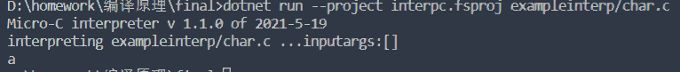
6. array数组

   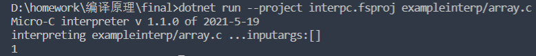
7. 自增，自减（前置后置都支持）i++先运算再加，++i先加再运算，--同理

   ```c
   int main(){
       int b; 
       b=0;
      print "%d" b++;
      print "%d" ++b;

   }//自增
   ```

   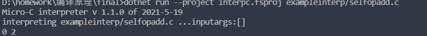

   ```c
   int main(){
       int b;
       b=2;
       print "%d" b--;
       print "%d" --b;

   }//自减
   ```

   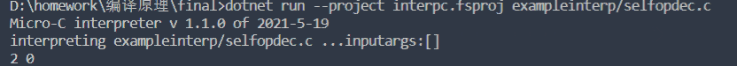
8. for循环(循环体内可以使用自增，自减)

```c
int main(){
    int i;
    for (i = 0; i < 2; i++)//(在编译器中i++报错。进入无限循环。)
    {
        print "%d" i;
    }
}
```

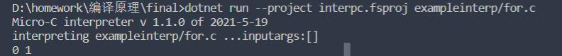

   9.dowhile循环(可用自增自减)

```c
int main() {
    int i;
    i=0;
   do {
        print "%d" i;
        //i++;//编译时栈溢出
        i=i+1;
   }  
   while(i<4);

}
```

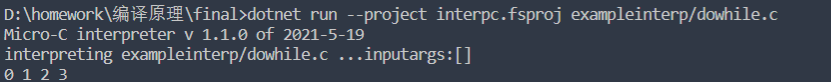

  10.dountil循环(自增自减支持)

```c
int main() {
    int i;
    i=0;
   do{
        print "%d" i ;
        i = i+1;//i++
   }  
   until(i>4);

}
```

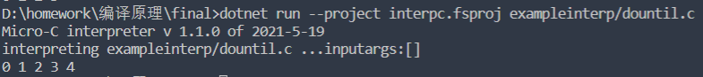

  11.break（break我是直接通过failwith直接跳出，可能不是很体面）

```c
int main(){
    int i;
    i=0;
   for( i = 0 ; i < 4;  i++){
        print "%d" i;
        if(i==2)
        break;
    }
}
```

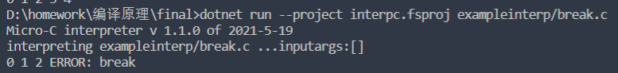

12.forin循环(自增自减支持)

```c
int main() {
  
    int i;
    for i in (3,7)
    {
        print "%d" i;
    }

}
```

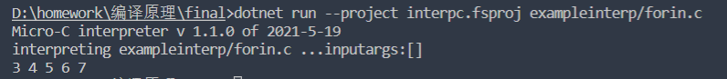

13.hex 16进制输出(不支持'a'-'f','A'-'F'含字符的16进制转换，只支持数字)

```c
int main() {
    int a;
    a = hex("121",16);
    print 16 a;
    print "%d" a;
}
```

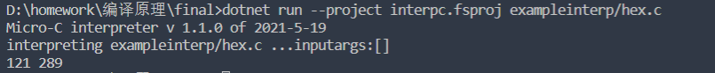

14.prim3三目运算符(如红圈，别忘传入n)

```c
int main(int n) {
    int i;
    i =  n>2?12:21;
    print "%d" i ;
  
}
```

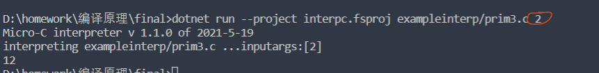

15. print，改进了它原来的print，使得其能输出浮点数、字符、整形、布尔、字符串（只有数字字符串），一开始因为字符转化之类的一直报错，后面看了.NETBitConverter的文档，发现string的转化不能通过读取byte，就直接进行了强制的转化。可能也是因为我string强制转化导致只能输出数字字符串。

    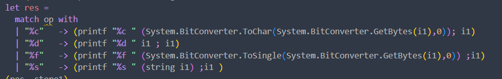
    (其中还增加了printhex输出16进制数 格式为print 16 i)

    ```c
    int main() {
               int a ;
               a=1;
               char b ;
               b='c';
               float f ;
               f=1.1;
               bool c ;
               c= false;
               print "%d" a ;
               print "%d" c ;
               print "%c" b ;
               print "%f" f;
               print "%f" a;
    }
    ```

    16.switch

    ```c
    int main(int n) {
        switch( n ){
            case 1 :  print "%d" n;
            case 2 :  print "%d" n+1;
            default : print "%d" 2;
        }
        print "%d" n;

    }
    ```

    编译器在MICORC的源代码的基础上进行改进

    编译器在原有的MICORC的源代码的基础上进行了更改，增添了float，char，bool，string（只有整数型）的类型，其中编译器的自增自减存在越栈的错误。所以在for、while、dowhile等循环中不使用自增或自减，而是i=i+1.使用了CUBY的java虚拟机。

    1.bool类型:

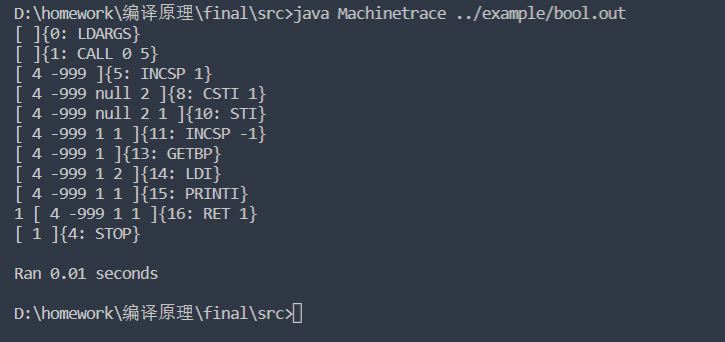

2.char类型：

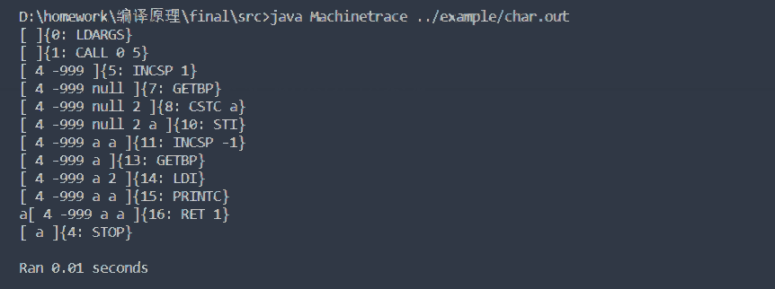

3.array:

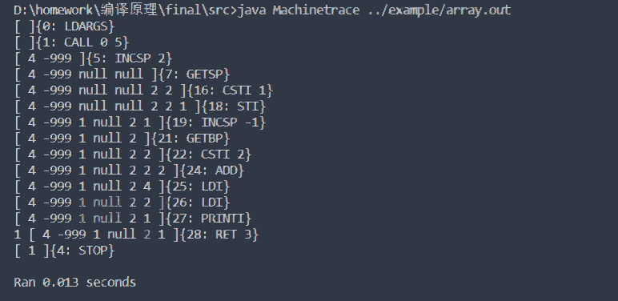

4.dountil:(太长了一张图截不下)

```
D:\homework\编译原理\final\src>java Machinetrace ../example/dountil.out
[ ]{0: LDARGS}
[ ]{1: CALL 0 5}
[ 4 -999 ]{5: INCSP 1}
[ 4 -999 null ]{7: GETBP}
[ 4 -999 null 2 ]{8: CSTI 0}
[ 4 -999 null 2 0 ]{10: STI}
[ 4 -999 0 0 ]{11: INCSP -1}
[ 4 -999 0 ]{13: GETBP}
[ 4 -999 0 2 ]{14: LDI}
[ 4 -999 0 0 ]{15: PRINTI}
0 [ 4 -999 0 0 ]{16: INCSP -1}
[ 4 -999 0 ]{18: GETBP}
[ 4 -999 0 2 ]{19: GETBP}
[ 4 -999 0 2 2 ]{20: LDI}
[ 4 -999 0 2 0 ]{21: CSTI 1}
[ 4 -999 0 2 0 1 ]{23: ADD}
[ 4 -999 0 2 1 ]{24: STI}
[ 4 -999 1 1 ]{25: INCSP -1}
[ 4 -999 1 ]{27: GETBP}
[ 4 -999 1 2 ]{28: LDI}
[ 4 -999 1 1 ]{29: CSTI 4}
[ 4 -999 1 1 4 ]{31: SWAP}
[ 4 -999 1 4 1 ]{32: LT}
[ 4 -999 1 0 ]{33: IFZERO 13}
[ 4 -999 1 ]{13: GETBP}
[ 4 -999 1 2 ]{14: LDI}
[ 4 -999 1 1 ]{15: PRINTI}
1 [ 4 -999 1 1 ]{16: INCSP -1}
[ 4 -999 1 ]{18: GETBP}
[ 4 -999 1 2 ]{19: GETBP}
[ 4 -999 1 2 2 ]{20: LDI}
[ 4 -999 1 2 1 ]{21: CSTI 1}
[ 4 -999 1 2 1 1 ]{23: ADD}
[ 4 -999 1 2 2 ]{24: STI}
[ 4 -999 2 2 ]{25: INCSP -1}
[ 4 -999 2 ]{27: GETBP}
[ 4 -999 2 2 ]{28: LDI}
[ 4 -999 2 2 ]{29: CSTI 4}
[ 4 -999 2 2 4 ]{31: SWAP}
[ 4 -999 2 4 2 ]{32: LT}
[ 4 -999 2 0 ]{33: IFZERO 13}
[ 4 -999 2 ]{13: GETBP}
[ 4 -999 2 2 ]{14: LDI}
[ 4 -999 2 2 ]{15: PRINTI}
2 [ 4 -999 2 2 ]{16: INCSP -1}
[ 4 -999 2 ]{18: GETBP}
[ 4 -999 2 2 ]{19: GETBP}
[ 4 -999 2 2 2 ]{20: LDI}
[ 4 -999 2 2 2 ]{21: CSTI 1}
[ 4 -999 2 2 2 1 ]{23: ADD}
[ 4 -999 2 2 3 ]{24: STI}
[ 4 -999 3 3 ]{25: INCSP -1}
[ 4 -999 3 ]{27: GETBP}
[ 4 -999 3 2 ]{28: LDI}
[ 4 -999 3 3 ]{29: CSTI 4}
[ 4 -999 3 3 4 ]{31: SWAP}
[ 4 -999 3 4 3 ]{32: LT}
[ 4 -999 3 0 ]{33: IFZERO 13}
[ 4 -999 3 ]{13: GETBP}
[ 4 -999 4 2 ]{19: GETBP}
[ 4 -999 4 2 2 ]{20: LDI}
[ 4 -999 4 2 4 ]{21: CSTI 1}
[ 4 -999 4 2 4 1 ]{23: ADD}
[ 4 -999 4 2 5 ]{24: STI}
[ 4 -999 5 5 ]{25: INCSP -1}
[ 4 -999 5 ]{27: GETBP}
[ 4 -999 5 2 ]{28: LDI}
[ 4 -999 5 5 ]{29: CSTI 4}
[ 4 -999 5 5 4 ]{31: SWAP}
[ 4 -999 5 4 5 ]{32: LT}
[ 4 -999 5 1 ]{33: IFZERO 13}
[ 4 -999 5 ]{35: RET 0}
[ 5 ]{4: STOP}

Ran 0.047 seconds
```

5.float ,float输出的时候一开始我一直都在报错说我越栈，最后发现

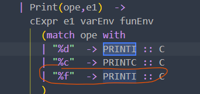PRINTI写成了PRINTF，然而虚拟机中根本没有定义PRINTF。

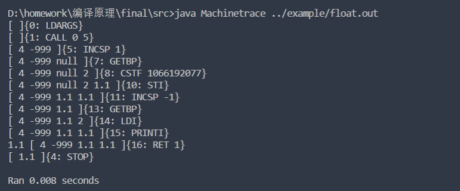

6.dowhile:

```
D:\homework\编译原理\final\src>java Machinetrace ../example/dowhile.out
[ ]{0: LDARGS}
[ ]{1: CALL 0 5}
[ 4 -999 ]{5: INCSP 1}
[ 4 -999 null ]{7: GETBP}
[ 4 -999 null 2 ]{8: CSTI 0}
[ 4 -999 null 2 0 ]{10: STI}
[ 4 -999 0 0 ]{11: INCSP -1}
[ 4 -999 0 ]{13: GETBP}
[ 4 -999 0 2 ]{14: LDI}
[ 4 -999 0 0 ]{15: PRINTI}
0 [ 4 -999 0 0 ]{16: INCSP -1}
[ 4 -999 0 ]{18: GETBP}
[ 4 -999 0 2 ]{19: GETBP}
[ 4 -999 0 2 2 ]{20: LDI}
[ 4 -999 0 2 0 ]{21: CSTI 1}
[ 4 -999 0 2 0 1 ]{23: ADD}
[ 4 -999 0 2 1 ]{24: STI}
[ 4 -999 1 1 ]{25: INCSP -1}
[ 4 -999 1 ]{27: GETBP}
[ 4 -999 1 2 ]{28: LDI}
[ 4 -999 1 1 ]{29: CSTI 4}
[ 4 -999 1 1 4 ]{31: LT}
[ 4 -999 1 1 ]{32: IFNZRO 13}
[ 4 -999 1 ]{13: GETBP}
[ 4 -999 1 2 ]{14: LDI}
[ 4 -999 1 1 ]{15: PRINTI}
1 [ 4 -999 1 1 ]{16: INCSP -1}
[ 4 -999 1 ]{18: GETBP}
[ 4 -999 1 2 ]{19: GETBP}
[ 4 -999 1 2 2 ]{20: LDI}
[ 4 -999 1 2 1 ]{21: CSTI 1}
[ 4 -999 1 2 1 1 ]{23: ADD}
[ 4 -999 1 2 2 ]{24: STI}
[ 4 -999 2 2 ]{25: INCSP -1}
[ 4 -999 2 ]{27: GETBP}
[ 4 -999 2 2 ]{28: LDI}
[ 4 -999 2 2 ]{29: CSTI 4}
[ 4 -999 2 2 4 ]{31: LT}
[ 4 -999 2 1 ]{32: IFNZRO 13}
[ 4 -999 2 ]{13: GETBP}
[ 4 -999 2 2 ]{14: LDI}
[ 4 -999 2 2 ]{15: PRINTI}
2 [ 4 -999 2 2 ]{16: INCSP -1}
[ 4 -999 2 ]{18: GETBP}
[ 4 -999 2 2 ]{19: GETBP}
[ 4 -999 2 2 2 ]{20: LDI}
[ 4 -999 2 2 2 ]{21: CSTI 1}
[ 4 -999 2 2 2 1 ]{23: ADD}
[ 4 -999 2 2 3 ]{24: STI}
[ 4 -999 3 3 ]{25: INCSP -1}
[ 4 -999 3 ]{27: GETBP}
[ 4 -999 3 2 ]{28: LDI}
[ 4 -999 3 3 ]{29: CSTI 4}
[ 4 -999 3 3 4 ]{31: LT}
[ 4 -999 3 1 ]{32: IFNZRO 13}
[ 4 -999 3 ]{13: GETBP}
[ 4 -999 3 2 ]{14: LDI}
[ 4 -999 3 3 ]{15: PRINTI}
3 [ 4 -999 3 3 ]{16: INCSP -1}
[ 4 -999 3 ]{18: GETBP}
[ 4 -999 3 2 ]{19: GETBP}
[ 4 -999 3 2 2 ]{20: LDI}
[ 4 -999 3 2 3 ]{21: CSTI 1}
[ 4 -999 3 2 3 1 ]{23: ADD}
[ 4 -999 3 2 4 ]{24: STI}
[ 4 -999 4 4 ]{25: INCSP -1}
[ 4 -999 4 ]{27: GETBP}
[ 4 -999 4 2 ]{28: LDI}
[ 4 -999 4 4 ]{29: CSTI 4}
[ 4 -999 4 4 4 ]{31: LT}
[ 4 -999 4 0 ]{32: IFNZRO 13}
[ 4 -999 4 ]{34: RET 0}
[ 4 ]{4: STOP}

Ran 0.041 seconds
```

7.for(因为我自增自减在编译器中报错，以至于一开始的时候在循环中写着i++以至于报错。后面改成了i=i+1成功运行)

```
D:\homework\编译原理\final\src>java Machinetrace ../example/for.out  
[ ]{0: LDARGS}
[ ]{1: CALL 0 5}
[ 4 -999 ]{5: INCSP 1}
[ 4 -999 null ]{7: GETBP}
[ 4 -999 null 2 ]{8: CSTI 0}
[ 4 -999 null 2 0 ]{10: STI}
[ 4 -999 0 0 ]{11: INCSP -1}
[ 4 -999 0 ]{13: GOTO 29}
[ 4 -999 0 ]{29: GETBP}
[ 4 -999 0 2 ]{30: LDI}
[ 4 -999 0 0 ]{31: CSTI 2}
[ 4 -999 0 0 2 ]{33: LT}
[ 4 -999 0 1 ]{34: IFNZRO 15}
[ 4 -999 0 ]{15: GETBP}
[ 4 -999 0 2 ]{16: LDI}
[ 4 -999 0 0 ]{17: PRINTI}
0 [ 4 -999 0 0 ]{18: INCSP -1}
[ 4 -999 0 ]{20: GETBP}
[ 4 -999 0 2 ]{21: GETBP}
[ 4 -999 0 2 2 ]{22: LDI}
[ 4 -999 0 2 0 ]{23: CSTI 1}
[ 4 -999 0 2 0 1 ]{25: ADD}
[ 4 -999 0 2 1 ]{26: STI}
[ 4 -999 1 1 ]{27: INCSP -1}
[ 4 -999 1 ]{29: GETBP}
[ 4 -999 1 2 ]{30: LDI}
[ 4 -999 1 1 ]{31: CSTI 2}
[ 4 -999 1 1 2 ]{33: LT}
[ 4 -999 1 1 ]{34: IFNZRO 15}
[ 4 -999 1 ]{15: GETBP}
[ 4 -999 1 2 ]{16: LDI}
[ 4 -999 1 1 ]{17: PRINTI}
1 [ 4 -999 1 1 ]{18: INCSP -1}
[ 4 -999 1 ]{20: GETBP}
[ 4 -999 1 2 ]{21: GETBP}
[ 4 -999 1 2 2 ]{22: LDI}
[ 4 -999 1 2 1 ]{23: CSTI 1}
[ 4 -999 1 2 1 1 ]{25: ADD}
[ 4 -999 1 2 2 ]{26: STI}
[ 4 -999 2 2 ]{27: INCSP -1}
[ 4 -999 2 ]{29: GETBP}
[ 4 -999 2 2 ]{30: LDI}
[ 4 -999 2 2 ]{31: CSTI 2}
[ 4 -999 2 2 2 ]{33: LT}
[ 4 -999 2 0 ]{34: IFNZRO 15}
[ 4 -999 2 ]{36: RET 0}
[ 2 ]{4: STOP}

Ran 0.023 seconds
```

8.switch：

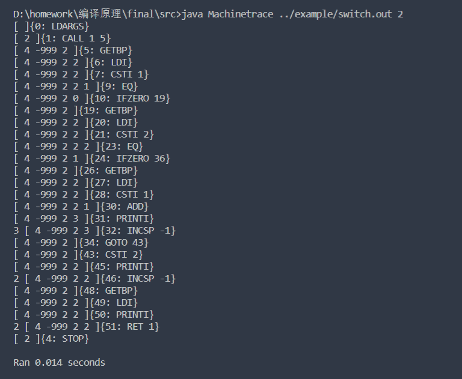

9.forin:

```
D:\homework\编译原理\final\src>java Machinetrace ../example/forin.out   
[ ]{0: LDARGS}
[ ]{1: CALL 0 5}
[ 4 -999 ]{5: INCSP 1}
[ 4 -999 null ]{7: GETBP}
[ 4 -999 null 2 ]{8: CSTI 3}
[ 4 -999 null 2 3 ]{10: STI}
[ 4 -999 3 3 ]{11: INCSP -1}
[ 4 -999 3 ]{13: GOTO 29}
[ 4 -999 3 ]{29: GETBP}
[ 4 -999 3 2 ]{30: LDI}
[ 4 -999 3 3 ]{31: CSTI 7}
[ 4 -999 3 3 7 ]{33: LT}
[ 4 -999 3 1 ]{34: IFNZRO 15}
[ 4 -999 3 ]{15: GETBP}
[ 4 -999 3 2 ]{16: LDI}
[ 4 -999 3 3 ]{17: PRINTI}
3 [ 4 -999 3 3 ]{18: INCSP -1}
[ 4 -999 3 ]{20: GETBP}
[ 4 -999 3 2 ]{21: GETBP}
[ 4 -999 3 2 2 ]{22: LDI}
[ 4 -999 3 2 3 ]{23: CSTI 1}
[ 4 -999 3 2 3 1 ]{25: ADD}
[ 4 -999 3 2 4 ]{26: STI}
[ 4 -999 4 4 ]{27: INCSP -1}
[ 4 -999 4 ]{29: GETBP}
[ 4 -999 4 2 ]{30: LDI}
[ 4 -999 4 4 ]{31: CSTI 7}
[ 4 -999 4 4 7 ]{33: LT}
[ 4 -999 4 1 ]{34: IFNZRO 15}
[ 4 -999 4 ]{15: GETBP}
[ 4 -999 4 2 ]{16: LDI}
[ 4 -999 4 4 ]{17: PRINTI}
4 [ 4 -999 4 4 ]{18: INCSP -1}
[ 4 -999 4 ]{20: GETBP}
[ 4 -999 4 2 ]{21: GETBP}
[ 4 -999 4 2 2 ]{22: LDI}
[ 4 -999 4 2 4 ]{23: CSTI 1}
[ 4 -999 4 2 4 1 ]{25: ADD}
[ 4 -999 4 2 5 ]{26: STI}
[ 4 -999 5 5 ]{27: INCSP -1}
[ 4 -999 5 ]{29: GETBP}
[ 4 -999 5 2 ]{30: LDI}
[ 4 -999 5 5 ]{31: CSTI 7}
[ 4 -999 5 5 7 ]{33: LT}
[ 4 -999 5 1 ]{34: IFNZRO 15}
[ 4 -999 5 ]{15: GETBP}
[ 4 -999 5 2 ]{16: LDI}
[ 4 -999 5 5 ]{17: PRINTI}
5 [ 4 -999 5 5 ]{18: INCSP -1}
[ 4 -999 7 2 ]{30: LDI}
[ 4 -999 7 7 ]{31: CSTI 7}
[ 4 -999 7 7 7 ]{33: LT}
[ 4 -999 7 0 ]{34: IFNZRO 15}
[ 4 -999 7 ]{36: RET 0}
[ 7 ]{4: STOP}

Ran 0.039 seconds
```

10.hex(编译器中的十六进制输出是直接把10进制的结果输出而不是16进制数字，这与我定义的printhex有关,比如我输入121，输出的是289，即121十六进制的十进制结果)

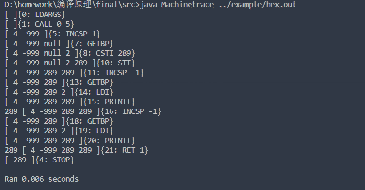

11.print:

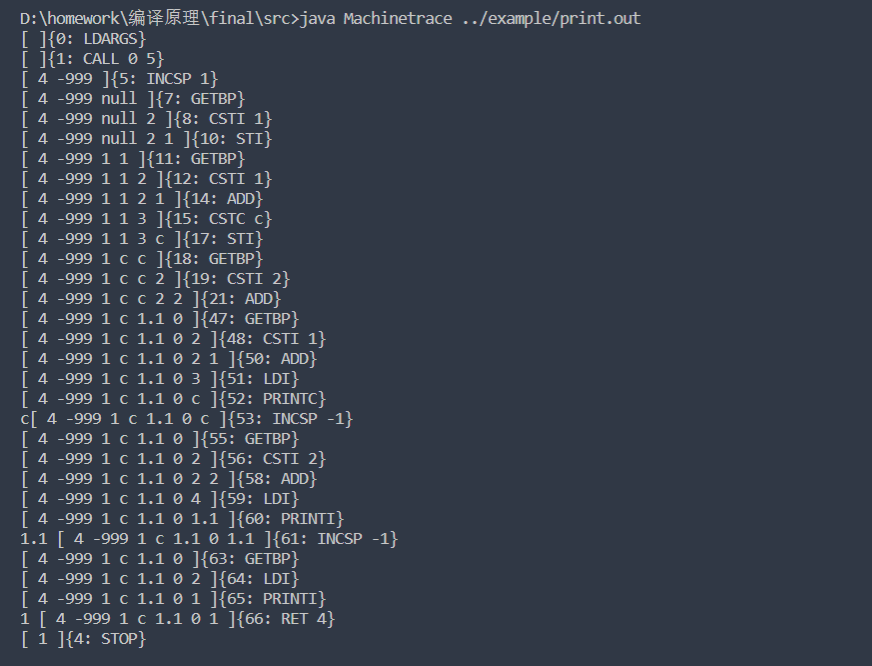

12.自增自减(有错，数组越界)

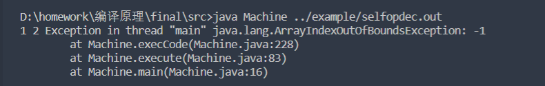

13.int类型（原有）

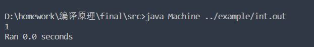

心得体会

  编译原理这一门课对于我来说起步时的困难还是比较大的，首先自己对编译理论知识的掌握还有待提高，其次对F#语言的掌握程度也不是很高。F#作为一门比较新的语言，除了官方的文档，网络上的资料也非常的少。导致一开始自己在编写程序的时候，处处碰壁。好在后面花时间去看文档，去一个个看定义才慢慢的有些许掌握F#。

  起初编写这个编译器与解释器的时候，真的是满头雾水。来到了一个以前从未接触的、崭新的区域。从一开始看抽象语法树，再慢慢的到词法分析，再到语法分析。最后自己能够在编译器与解释器中加入新的内容，当然这之中我也处处碰壁。比如最开始我定义的bool类型，我在那疯狂定义true和false，并且企图把它俩通过BitConvert来转化为int32，真的卡了好一会，然后去写了float。写着写着豁然开朗，让true映射1，false映射0不就好了吗。之后的char、float也变得快速了起来。在const中通过BitConvert转化为int32，再在print中通过BitConvert转化为浮点数或字符输出。在解释器中的编写还是比较舒服的，可能是因为解释器比编译器好写一些吧（个人感觉），但是在编译器的时候就出现了各种问题。首先是看不懂，第一步就走不出去，花时间看明白后自己编写又处处报错，比如数组越界、栈溢出各种问题。有时候是传入的n没有输入，有时候是把栈顶-1写成了0.不过最后还是完成了一些功能的编写。过程可以说是非常的曲折，但是好在自己坚持了。也更深层的了解了抽象语法树、词法、语法之间的关系，也更深层的了解了编译原理这门课程。

本课程建议

  本课程实验的F#和教材不是很契合，有时候去教材找相应的原理，也没有F#的例子更多的是c语言。希望老师可以在实验课中多多讲述一下F#的使用，或者带着同学们做一些实验内容，又或者讲述一下上一次实验的题目等内容，以便更方便同学们理解。课堂中的抽验的一些题目，虽然有些题目在ppt中有，但是还是希望老师可以讲解一下错的比较多的题目。有时候自己做了，交上去但是不知道自己到底是做对还是做错。
