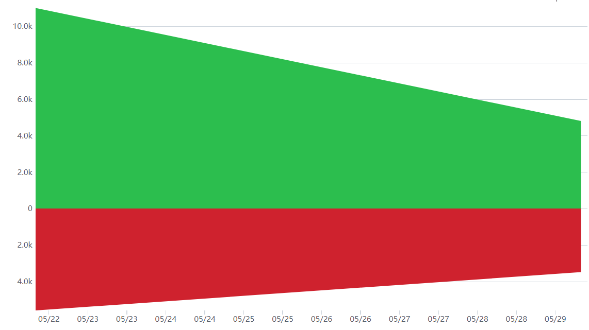
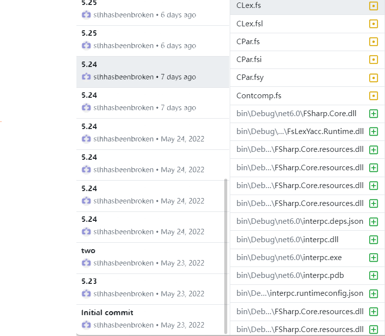

# [2020-2021学年第2学期](https://plc-sigcc.vercel.app/#/lab/proj.final?id=_2020-2021%e5%ad%a6%e5%b9%b4%e7%ac%ac2%e5%ad%a6%e6%9c%9f)

# [**实 验 报 告**](https://plc-sigcc.vercel.app/#/lab/proj.final?id=%e5%ae%9e-%e9%aa%8c-%e6%8a%a5-%e5%91%8a)

* 课程名称:编程语言原理与编译
* 实验项目:期末大作业
* 专业班级__计算1903_
* 学生学号__31901072_
* 学生姓名__高扬_
* 实验指导教师:张芸

| 姓名 | 学号     | 班级     | 任务 | 权重 |
| ---- | -------- | -------- | ---- | ---- |
| 高扬 | 31901072 | 计算1903 | 全部 | 1.0  |

成员代码提交日志：

| 解释器   | 完善程度 | 难度 | 备注                                       |
| -------- | -------- | ---- | ------------------------------------------ |
| array    | 4        | 1    |                                            |
| bool     | 5        | 2    |                                            |
| break    | 5        | 1    |                                            |
| char     | 5        | 1    |                                            |
| dountil  | 5        | 1    |                                            |
| dowhile  | 5        | 1    |                                            |
| float    | 5        | 3    |                                            |
| for      | 5        | 1    |                                            |
| forin    | 5        | 2    |                                            |
| hex      | 3        | 3    | 存在读入['a'-'f']['A'-'F']字符报错         |
| if       | 5        | 1    |                                            |
| int      | 5        | 1    |                                            |
| 三元运算 | 5        | 2    |                                            |
| print    | 5        | 1    |                                            |
| 自增     | 5        | 1    | 解释器中的自增在.c文件可写入循环等多种语境 |
| 自减     | 5        | 1    | 解释器中的自减在.c文件可写入循环等多种语境 |
| string   | 3        |      |                                            |
| switch   | 5        |      |                                            |
